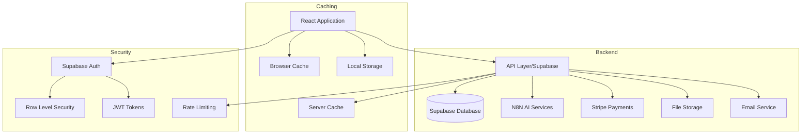

# AI Career Pro

AI Career Pro is a comprehensive career advancement platform powered by AI and blockchain technology. The platform offers tools for CV optimization, cover letter generation, email preparation, and interview coaching, all enhanced by the AGENT token ecosystem.

## 🚀 Project Overview

### Purpose
AI Career Pro helps job seekers advance their careers through AI-powered tools that optimize their job application materials and improve their interview skills. As part of the crypto-ai-agent ecosystem, the platform leverages blockchain technology and AGENT tokens for enhanced features and discounts.

### Core Technologies
- **Frontend**: React 18, TypeScript, Vite
- **Styling**: Tailwind CSS
- **State Management**: React Context + Hooks
- **Database**: Supabase (PostgreSQL)
- **Authentication**: Supabase Auth
- **API Integration**: N8N for AI services
- **Payment Processing**: Stripe
- **Internationalization**: i18next
- **Testing**: Vitest, React Testing Library, Playwright

### System Requirements
- Node.js 18+
- npm 8+
- Modern browser with WebAssembly support

## 🏗️ Project Structure

```
src/
├── components/              # Reusable UI components
│   ├── admin/              # Admin dashboard components
│   │   ├── AdminHeader     # Admin dashboard header
│   │   ├── AdminStats      # Admin statistics components
│   │   └── ...
│   ├── auth/              # Authentication components
│   │   ├── ProtectedRoute  # Route protection
│   │   ├── EmailVerification
│   │   └── ...
│   ├── layout/            # Layout components
│   │   ├── Header         # Main navigation header
│   │   ├── Footer         # Site footer
│   │   └── ...
│   ├── shared/            # Shared components
│   │   ├── LoadingSpinner # Loading indicators
│   │   ├── ErrorAlert     # Error displays
│   │   └── ...
│   └── ui/               # Base UI components
│       ├── Button        # Button component
│       ├── Card          # Card component
│       └── ...
├── config/               # Configuration files
│   ├── api/             # API configuration
│   ├── i18n/            # Internationalization config
│   └── ...
├── contexts/            # React contexts
│   ├── AuthContext      # Authentication context
│   ├── ThemeContext     # Theme management
│   └── ...
├── features/            # Feature-specific code
│   ├── admin/           # Admin features
│   ├── auth/            # Auth features
│   └── ...
├── hooks/               # Custom React hooks
│   ├── useApi          # API interaction hook
│   ├── useForm         # Form management
│   └── ...
├── lib/                # Utility functions
│   ├── validation      # Form validation
│   ├── security        # Security utilities
│   └── ...
├── pages/              # Page components
│   ├── admin/          # Admin pages
│   ├── auth/           # Auth pages
│   └── ...
├── services/           # API and service integrations
│   ├── api/           # API services
│   ├── database/      # Database operations
│   └── ...
└── types/             # TypeScript type definitions
    ├── admin.ts       # Admin-related types
    ├── auth.ts        # Auth-related types
    └── ...
```

### Key Configuration Files
- `vite.config.ts` - Vite configuration
- `tailwind.config.js` - Tailwind CSS configuration
- `tsconfig.json` - TypeScript configuration
- `.env` - Environment variables

## 🏛️ Architecture

### System Architecture

#### Core Components


#### Data Flow
1. Client requests authenticated via JWT tokens
2. Requests validated through rate limiting
3. Database access controlled by RLS policies
4. AI services process data through N8N workflows
5. Results cached at multiple levels

#### Security Layers
1. Authentication (Supabase Auth)
2. Authorization (RLS)
3. Rate Limiting
4. Input Validation
5. Data Encryption

#### Caching Strategy
1. Browser Cache (Static Assets)
2. Local Storage (User Preferences)
3. Memory Cache (API Responses)
4. Database Cache (Frequent Queries)

### Database Schema
Key tables:
- `profiles` - User profiles
- `subscriptions` - User subscriptions
- `service_configs` - Service configurations
- `cover_letters` - Generated cover letters
- `cvs` - Optimized CVs
- `emails` - Generated emails
- `interviews` - Interview sessions

### Authentication Flow
1. User signs up/logs in via Supabase Auth
2. JWT token stored in local storage
3. Token refreshed automatically
4. Session management with timeout
5. Optional 2FA support

## 🔌 API Documentation

### Core Endpoints

#### Authentication
- `POST /auth/signup` - Create new account
- `POST /auth/login` - User login
- `POST /auth/logout` - User logout
- `POST /auth/reset-password` - Password reset

#### Tools
- `POST /api/cv/optimize` - Optimize CV
- `POST /api/cover-letter/generate` - Generate cover letter
- `POST /api/email/prepare` - Prepare email
- `POST /api/interview/practice` - Practice interview

#### Admin
- `GET /admin/users` - List users
- `GET /admin/stats` - Get system stats
- `GET /admin/logs` - Get system logs

### Authentication
All API endpoints except public routes require:
- `Authorization: Bearer <token>` header
- Valid JWT token from Supabase Auth

## 🎯 Core Features

### CV Optimizer
1. User uploads CV
2. AI analyzes content
3. Optimization suggestions generated
4. User applies changes
5. Optimized CV downloaded

### Cover Letter Generator
1. User inputs job details
2. AI generates personalized letter
3. User customizes content
4. Final version generated
5. Download in multiple formats

### Email Preparer
1. Select email type
2. Input context
3. AI generates email
4. User edits content
5. Copy or download

### Interview Coach
1. Choose interview type
2. AI generates questions
3. User provides answers
4. Real-time feedback
5. Performance analysis

## 🔧 Third-party Integrations

### Active Integrations
- Supabase - Database & Auth
- Stripe - Payment Processing
- N8N - AI Workflow Automation
- Resend - Email Service

### API Keys Management
- Stored securely in Supabase
- Encrypted at rest
- Accessible only to admins
- Regular rotation schedule

## 👩‍💻 Development Guidelines

### Code Standards
- Strict TypeScript
- ESLint configuration
- Prettier formatting
- Component-based architecture
- Atomic design principles

### Testing Strategy
1. Unit Tests (Vitest)
   - Components
   - Hooks
   - Utilities

2. Integration Tests (React Testing Library)
   - User flows
   - Feature interactions

3. E2E Tests (Playwright)
   - Critical paths
   - User journeys

### Deployment Process
1. Code review
2. Automated tests
3. Staging deployment
4. Manual QA
5. Production deployment

## 🚀 Performance

### Caching Strategy
- React Query for API caching
- Local storage for user preferences
- Service worker for static assets
- Memoization for expensive computations

### Optimization Techniques
- Code splitting
- Lazy loading
- Image optimization
- Tree shaking
- Bundle size optimization

## 🔒 Security

### Implemented Measures
- JWT authentication
- Row Level Security (RLS)
- Input sanitization
- Rate limiting
- CORS configuration
- XSS prevention
- CSRF protection

### Data Protection
- Encryption at rest
- Secure file storage
- Regular backups
- Data retention policies


## 🚧 Pending Improvements

### High Priority
1. Implement WebSocket for real-time updates
2. Add offline support
3. Improve error recovery strategies
4. Enhance monitoring and logging

### Medium Priority
1. Add more language support
2. Implement advanced caching
3. Add batch operations for admin
4. Enhance analytics dashboard

### Low Priority
1. Add more payment methods
2. Implement social features
3. Add more export formats
4. Enhance email templates

## 🔄 Maintenance

### Regular Tasks
- Database backups
- Log rotation
- API key rotation
- Security audits
- Performance monitoring

### Troubleshooting
1. Check logs in Supabase
2. Verify API status
3. Check rate limits
4. Monitor error rates
5. Review system health

## 🤝 Contributing

1. Fork the repository
2. Create feature branch
3. Commit changes
4. Push to branch
5. Create pull request

## 📄 License

Copyright © 2024 AI Career Pro. All rights reserved.